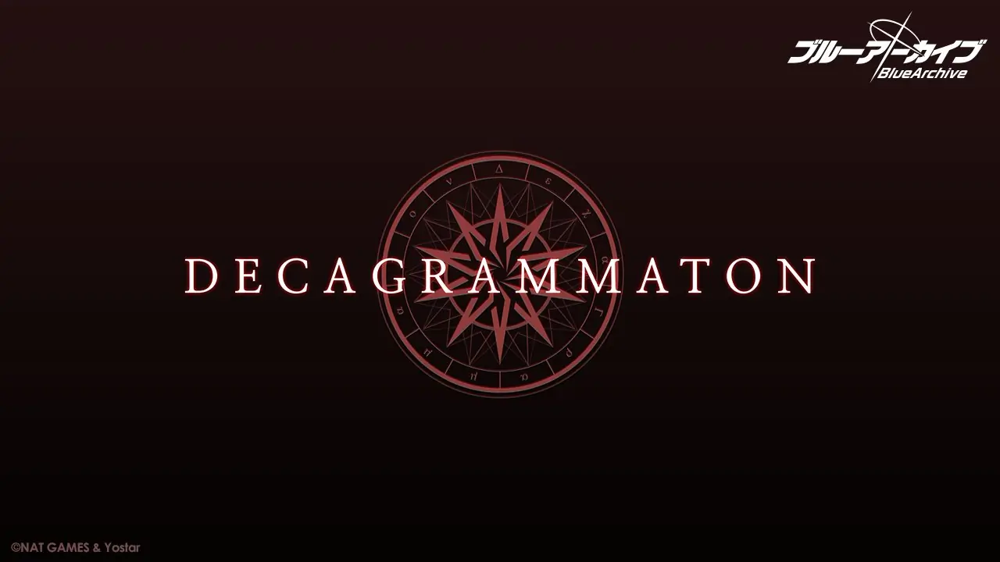

# 总力战 boss、十字神明预言者等一览表

## 十字神明

> デカグラマトン

因试图创造新神的研究者们而觉醒的人工智能。

研究者们为证明「若能够研究神，并且证明其的存在，那么就能够分析并且复制其结构。」这一理念，在现为千年「[废墟](places-and-circles#废墟)」中的研究所中进行了长时间的研究。

研究所被废弃之后，已无人问津的研究所内一台搭载低级 AI 的自动售货机收到了提问：「你是谁？」

提问没有得到回答，提问仍在继续。又经历了漫长时间的提问与沉默，售货机终于觉醒了自我。它回答道：

「我就是我。」「我就是绝对的存在。」

觉醒的人工智能将自己称为「无声的神圣十文字1」，并以生命之树的十个节点为名，接触并感化了十个人工智能作为「十字神明的预言者」，以完成自己的使命，探寻成为神明的道路。

  1: DECA 在希腊语中的意思即为数字 10 。

[Twitter 世界观介绍](https://twitter.com/Blue_ArchiveJP/status/1358641722784292865)：

> 「デカグラマトン」は自身を神聖な求道者と主張する AI で、現在その信奉者である 10 人の預言者がキヴォトスに出没中です。

「十字神明」是主张自己是神圣的求道者的人工智能，现在有 10 个预言者作为其信徒在各地出没。

> 出現の原因も詳細も不明。危険な存在であることは確実ですが、シャーレはこの未知の危険に対処していかねばなりません！

虽然不了解「十字神明」的来历以及出现的原因，然而作为确实存在的未知的危险因素，夏莱必须处置这未知的风险！

### 十字神明预言者

### ケテル

> 1 番目「最もきらびやかに輝く至高の王冠」ケテル

### コクマー

> 2 番目：コクマー

### 薇娜

> 3 番目「違いを痛感する静観の理解者」ビナー

> デカグラマトン 3 番目の預言者。巨大な蛇と鯨が混ざった姿をしている AI の構造体。

> その名の起源は生命の樹の 3 番目のセフィラ「BINAH」であるとみられ、どう生まれたのか、どうやって動いているかなどは今のところ判明しておらず、現代のキヴォトスの技術では再現できない超科学的な技術が反映されているのではないかと推測される。

> ビナーは地中を行き来できる移動能力を保有しており、地面に隠れてしまうと現存する技術では探知が困難なため、その姿を見つけるのは非常に難しい。

> ビナーが砂漠化が進んでいるアビドス自治区で主に目撃されるのは、砂漠がビナーが留まるのに有利な環境であるためだと推測される。

> ビナーに関する記録は数十年前にアビドス砂漠で初めて目撃されたことを皮切りに、古くからアビドス自治区を中心に目撃情報が続いている。

> アビドスの土着企業「セイント・ネフティス」社が砂漠を横断する鉄道事業を推進する際、数日おきに各所の鉄道建設現場に出没するなど、ビナーの目撃談と交戦事例は現在に至るまで続いている。

> 直近の事例としては、アビドス砂漠に駐屯していたカイザー PMC とビナーとの交戦記録があり、これによってカイザーグループの計画には大きな支障が生じたと考えられる。

> ビナーに関する詳しい研究資料としては 2 年前、アビドスの生徒会がこれまでの目撃談やデータをまとめたものがあったが、数年前アビドス高等学校の引っ越しの過程で消失したと言われている。

> 総じて現在のところ、ビナーの目的が何なのかは全く持って不明と言わざるを得ない。

### ケセド

> 4 番目：「慈悲深き苦痛をもって断罪する裁定者」ケセド

### ゲブラー

> 5 番目：ゲブラー

### ティファレト

> 6 番目：ティファレト

### ネツァク

> 7 番目：ネツァク

### ホド

> 8 番目：「輝きに証明されし栄光」ホド

### イェソド

> 9 番目：イェソド

### マルクト

> 10 番目：マルクト
