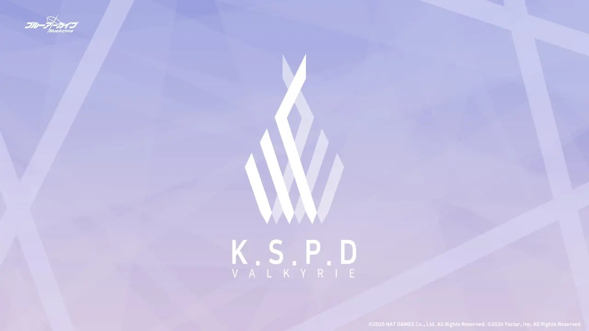
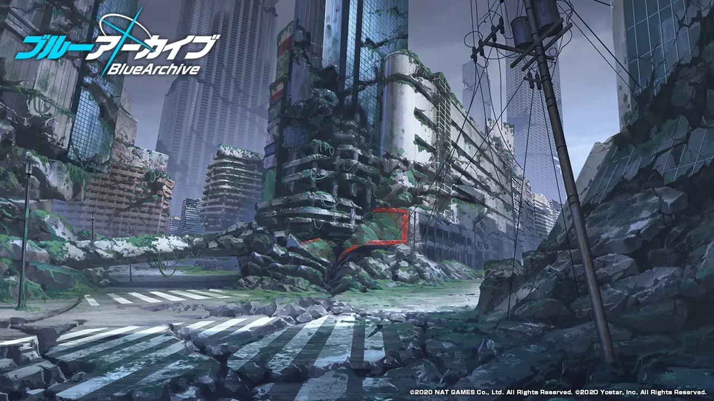

<!--suppress ES6UnusedImports -->

# 地名、学校名及社团名一览表

本页面收录了《碧蓝档案》中出现的地名、学校名以及社团名。部分内容翻译、参考、整合自[日语 Wiki](https://bluearchive.wikiru.jp/?%E7%94%A8%E8%AA%9E%E9%9B%86) 、[官方 Twitter](https://twitter.com/Blue_ArchiveJP)以及 UP 主 [朝夕 desu](https://space.bilibili.com/4607471) 的合集《[碧蓝档案主线剧情梳理](https://space.bilibili.com/4607471/channel/collectiondetail?sid=485727&ctype=0)》。

## 目录

点击展开…

[[toc]]

## 基沃托斯

> キヴォトス

三大自治区：[格黑娜自治区](#格黑娜自治区)｜[圣三一自治区](#圣三一自治区)｜[千年自治区](#千年自治区)

## D.U.

> District of Utnapishtim

全名为乌塔纳皮什提1区。语源为《吉尔伽美什史诗》中的人物，其和其妻子作为古代大洪水中仅存的人类获得了永生，是《旧约圣经》中洪水幸存者诺亚的原型2。

在此区域的实体有： [夏莱](#夏莱)

1: 拱玉书. 吉尔伽美什史诗[M]. 1. 商务印书馆, 2021 :229. 
2: 拱玉书. 吉尔伽美什史诗[M]. 1. 商务印书馆, 2021 :27.

### 白鸟区

> シラトリ区

[圣所之塔](#圣所之塔)所在的区域？

### 钟崎港

> 鐘崎港

[D.U.](#d-u)区域内的港湾。

## 圣所之塔

> サンクトゥムタワー

## 夏莱

> シャーレ (Schale)

[D.U.](#d-u)内部的实体。

### 天使 24

> エンジェル 24

[夏莱](#夏莱)内部的便利店。

店员：空

## 阿比多斯自治区

> アビドス (Abydos)

此区域内的实体有： [阿比多斯高级中学](#阿比多斯高级中学)｜[对策委员会](#对策委员会)

### 阿比多斯高级中学

> アビドス高等学校

[阿比多斯自治区](#阿比多斯自治区)内部的学校。

位于沙漠地带的学校，住宅区与沙漠相邻。曾经是基沃托斯最大自治区之一，但由于数十年前大规模沙尘暴持续频发，学校不得不向凯撒金融贷款用于治理天灾，最终背下了 9 亿 6325 万元的欠款3。目前学校内只剩下 5 名学生，欠款分 309 年才能还清4。

阿比多斯之名源于埃及神话中掌管冥界的王奥西里斯复活的地方「阿拜多斯（Abydos）」。该地在现在的埃及索哈杰省境内。

3: [第一章 03 话](chapters#03-委员会的现状) 
4: [第一章 09 话](chapters#09-寻找线索)

校内社团：[对策委员会](#对策委员会)

<StudentListByFilter
  filter-by="school"
  property="阿比多斯"
  :students="students"
/>

### 阿比多斯学生会

> アビドス生徒会

本篇开始的 2 年前已经停止活动，副会长星野是最后的成员。

阿比多斯事件结束后，老师（玩家）将学生会的权限与业务全部移交给了[对策委员会](#对策委员会)。

[阿比多斯高级中学](#阿比多斯高级中学)内部曾存在的社团

副会长：[小鸟游星野](characters#小鸟游-星野)

### 对策委员会

> 対策委員会

[阿比多斯高级中学](#阿比多斯高级中学)内部的社团

<StudentListByFilter
  filter-by="club"
  property="对策委员会"
  :students="students"
/>

### 蒙面泳装团

> 覆面水着団

成员：[阿慈谷日富美](characters#阿慈谷-日富美)｜[小鸟游星野](characters#小鸟游-星野)｜[砂狼白子](characters#砂狼-白子)｜[十六夜野宫](characters#十六夜-野宫)｜[黑见芹香](characters#黑见-芹香)｜[奥空绫音](characters#奥空-绫音)

### 圣奈芙蒂斯

> セイント・ネフティス

[野宫](characters#十六夜-野宫)胸前挂牌和鞋子上出现的企业名。阿拜多斯的本土企业，计划修建横穿沙漠的铁路工程，然而不断被[薇娜](bosses#薇娜)干扰3。

3: [薇娜](bosses#薇娜)

### 乌塔纳皮什提母舰

> ウトナピシュティムの本船

> アビドス砂漠の地下に埋もれていた「宇宙戦艦」。カイザーがアビドスの土地所有権を執拗に狙っていたのはこの船を発掘するためだった。

埋在阿比多斯沙漠地下的「宇宙战舰」，全长 135m × 23m × 13m4。联邦学生会以基沃托斯行政中枢所在的[D.U.](#du)命名此舰。

在剧情第一章《[对策委员会奇妙的一天](chapters#第一章-对策委员会奇妙的一天)》中，凯撒集团为了找到这艘「战舰」而执著于让阿比多斯废校，以获取当地的土地管辖权。

> 全長 135m×23m×13m。起動にはサンクトゥムタワーかシッテムの箱が必要とされる。

启动「母舰」需要[圣所之塔](#圣所之塔)或是[什亭之箱](others#什亭之箱)。最终章《[所在皆是奇迹的起点](chapters#最终章-所在皆是奇迹的起点)》中凯撒集团出于这一点而发动对联邦学生会的政变，以期获取[圣所之塔](#圣所之塔)的控制权。

> 便宜上宇宙戦艦と呼ばれているが、実際は飛行可能な限界高度は 10 万 m で宇宙に行けるほどではなく、武装が付いていないため戦艦でもない。
>
> その実態は「名もなき神」と敵対する勢力がアトラ・ハシースの箱舟に対抗するために作り出した飛行可能な巨大量子コンピュータ。

虽然叫做宇宙战舰，但最高飞行高度仅为 10 万米，并不能用于宇宙航行5。而且也没有装备武器，也称不上战舰。其真身是与「无名神祇」敌对的势力为了对抗[阿特拉哈西斯的方舟](#阿特拉哈西斯的方舟)而制造的可以飞行的巨大量子计算机。

> 船体の 75％以上が論理演算機能に割かれており、箱舟の機能の解析、無効化、ハッキングによる制圧を行うための装置になっている。

飞船船体的 75%以上的区域都被用于逻辑运算，用于对[阿特拉哈西斯的方舟](#阿特拉哈西斯的方舟)的功能进行解析、反制、以及通过黑入「方舟」逻辑运算系统以压制其空间演算功能。

> ウトナピシュティムはギルガメシュ叙事詩の登場人物。大洪水から生き延びた者とされ、アトラ・ハシース叙事詩のアトラ・ハシース、旧約聖書のノアに当たる。

乌塔纳皮什提之典出自《吉尔伽美什史诗》。其为古代“大洪水”后幸存的人物，与《阿特拉哈西斯》中的国王阿特拉哈西斯，《旧约》中的诺亚定位接近。

> キヴォトスの中枢部である D.U.（District of Utnapishtim）の名前にも使われている。

4: 正好是《旧约》中诺亚方舟的尺寸：6:15方舟的造法乃是这样：要长三百肘，宽五十肘，高三十肘。 
5: 划分大气层与太空界限的「卡门线」位于地球上空 80km（NASA）-100km（FAI），具体高度定义因机构而异。

## 阿里乌斯自治区

> アリウス (Arius)｜繁中译奥利斯

> 第一回公会議前に数多く存在した分派の一つ。

> 分派が連合を組むことに猛烈に反対し、その結果、連合化したトリニティに徹底的な糾弾を受けた。

旧圣三一自治区中拥护人数众多的分派之一，反对旧圣三一分校的联合。第一次公会议后被联合的现圣三一分校镇压并驱逐。目前隐藏在阿里乌斯自治区中，即使在现圣三一校内也仅有一部分学生知道其存在。

> 現在はトリニティのカタコンベに通じる迷宮じみた地下通路を経た先にある自治区に隠れ潜んでいる。

> 自治区内には、聖徒会の手引きで建設された分校とバシリカ、その 2 つを繋ぐ地下回廊が存在している。

> 弾圧や排斥を受けたのは随分と昔で、当事者のトリニティでも一部生徒がかつて存在していたのを知ってると言う知識上の存在になっている。

> 本編開始の 10 年ほど前まで凄惨な内戦が起きており、そこにベアトリーチェが介入することで自治区を支配下においた。

本作故事开始的约十年前，阿里乌斯自治区内部曾发生过大型内战。[数秘术](#数秘术)的「夫人」[贝亚特莉切](#贝亚特莉切)趁机介入，将自治区纳入其支配之下。

> その後、自治区内の一部の遺跡は訓練場として、射撃や爆弾製作の場に使われており、キヴォトスで生産が禁じられているサーモバリック手榴弾が大量に投棄されている。

> 学校とは名ばかりで世代を越えて敵への怒り、世界への憎悪を植え付け、一般的な教育をなおざりにして戦闘技術やヘイローの破壊方法などの殺人術を教え込む。

> そして、その教育と環境が当たり前のものと認識させる。

> 上記の教育はベアトリーチェが支配してからのもので、それ以前がどうだったかは不明。

> 生徒のヘイローは十字架を模したデザインが主。他校では実銃に装飾を施した銃火器を持つ生徒が多い中、彼女らの火器は実銃そのまま。

> 戦闘力は高いものの、隠れ潜む勢力故か寡兵かつ兵站は弱く、外部からの支援がないと満足に作戦行動を起こせない模様。

> 元ネタのアリウス派はキリスト教の主流思想である三位一体(トリニティ)を否定し、異端として排斥された学派。

阿里乌斯原型来源于基督教的「异教」阿里乌斯派。其否定作为基督教主流的三位一体思想，被视为异端而被排斥。

此区域内的实体有： [阿里乌斯分校](#阿里乌斯分校)｜[阿里乌斯小队](#阿里乌斯小队)

### 阿里乌斯分校

### 阿里乌斯小队

> アリウススクワッド

<StudentListByFilter
  filter-by="club"
  property="阿里乌斯小队"
  :students="students"
/>

## 瓦尔基里警察学校

> ヴァルキューレ警察学校

[Twitter 世界观介绍](https://twitter.com/Blue_ArchiveJP/status/1434426328653058049)：

> ヴァルキューレ警察学校は、キヴォトスの様々な問題対処に携わっている学校です。

> そのため各地に拠点が存在し、正義感に満ちた生徒さんが多いのですが、各自治体の制限等により結果ヴァルキューレだけでの解決はほぼないご様子…。

此区域内的实体有：[公安局](#公安局)｜[生活安全局](#生活安全局)

<StudentListByFilter
filter-by="school"
property="瓦尔基里"
:students="students"
/>

### 公安局

> 公安局

[瓦尔基里警察学校](#瓦尔基里警察学校)内部的社团

<StudentListByFilter
filter-by="club"
property="公安局"
:students="students"
/>

### 生活安全局

> 生活安全局

[瓦尔基里警察学校](#瓦尔基里警察学校)内部的社团

<StudentListByFilter
filter-by="club"
property="生活安全局"
:students="students"
/>

### 警备局

> 警備局

### 联邦矫正局

> 連邦矯正局

## 克洛诺斯学校

> クロノススクール

此区域内的实体有： [报导部](#报导部)

学校成员：[川流　シノン](characters#川流-シノン)｜[マイ](characters#マイ)

### 报导部

> 報道部

[克洛诺斯学校](#克洛诺斯学校)内部的社团

社团成员：[川流　シノン](characters#川流-シノン)｜[マイ](characters#マイ)

## 格黑娜自治区

> ゲヘナ (Gehenna)，语源为欣嫩谷（耶路撒冷的一个谷地）。在希伯来圣经中，这里最初是犹大诸王以火献祭自己孩子给摩洛的地方。从此这个地方便被认为受到了诅咒，常被作为“炼狱”的代名词。3

[基沃托斯三大自治区](#基沃托斯)之一

此区域内的实体有：[格黑娜学园](#格黑娜学园)｜[万魔殿](#万魔殿)｜[风纪委员会](#风纪委员会)｜[便利屋 68](#便利屋-68)｜[美食研究会](#美食研究会)｜[供餐部](#供餐部)｜[急救医学部](#急救医学部)｜[温泉开发部](#温泉开发部)｜[回家部](#回家部)

3: [欣嫩子谷](https://zh.wikipedia.org/wiki/%E6%AC%A3%E5%AB%A9%E5%AD%90%E8%B0%B7)

### 欣嫩谷火山

> ヒノム火山

### 阿比斯（还是直译深渊？）

> アビス

> ゲヘナのヒノム火山にある未開の地。

坐落于[格黑娜自治区](#格黑娜自治区)的欣嫩谷火山地区的未开发地带。

> 詳細は不明だが、ミレニアムの「廃墟」やトリニティの「カタコンベ」と同質のものとヒマリは推察している。

虽然详细信息尚不明确，然而日鞠推测此处的性质与千年的「废墟」以及圣三一的「地下墓穴」相同。

### 阿拉巴海岸

> アラバ海岸

> ゲヘナにあるリゾート地。

位于[格黑娜](#格黑娜)内部的度假地。

活动《[风纪委员会行政官紧急特别任务命令](events-and-gacha#风纪委员会行政官紧急特别任务命令)》的地点。

### 格黑娜学园

> ゲヘナ学園

管辖[格黑娜自治区](#格黑娜自治区)的学校

此区域内的实体有：[万魔殿](#万魔殿)｜[风纪委员会](#风纪委员会)｜[便利屋 68](#便利屋-68)｜[美食研究会](#美食研究会)｜[供餐部](#供餐部)｜[急救医学部](#急救医学部)｜[温泉开发部](#温泉开发部)｜[回家部](#回家部)

<StudentListByFilter
  filter-by="school"
  property="格黑娜"
  :students="students"
/>

### 万魔殿

> <ruby>万魔殿<rt>パンデモニウム・ソサエティー</rt></ruby>

[格黑娜学园](#格黑娜学园)内部的社团

<StudentListByFilter
  filter-by="club"
  property="万魔殿"
  :students="students"
/>

### 风纪委员会

> 風紀委員会

[格黑娜学园](#格黑娜学园)内部的社团

<StudentListByFilter
  filter-by="club"
  property="风纪委员会"
  :students="students"
/>

### 便利屋 68

> 便利屋 68

[格黑娜学园](#格黑娜学园)内部的社团

<StudentListByFilter
  filter-by="club"
  property="便利屋68"
  :students="students"
/>

### 美食研究会

> 美食研究会

[格黑娜学园](#格黑娜学园)内部的社团

<StudentListByFilter
  filter-by="club"
  property="美食研究会"
  :students="students"
/>

### 供餐部

> 給食部

[格黑娜学园](#格黑娜学园)内部的社团

<StudentListByFilter
  filter-by="club"
  property="供餐部"
  :students="students"
/>

### 急救医学部

> 救急医学部

[格黑娜学园](#格黑娜学园)内部的社团

<StudentListByFilter
  filter-by="club"
  property="急救医学部"
  :students="students"
/>

### 温泉开发部

> 温泉開発部

[格黑娜学园](#格黑娜学园)内部的社团

<StudentListByFilter
  filter-by="club"
  property="温泉开发部"
  :students="students"
/>

### 回家部

> 帰宅部

[格黑娜学园](#格黑娜学园)内部的社团

社团成员：[エリカ](characters#エリカ)｜[キララ](characters#キララ)

## 山海经

> 山海経

此区域内的实体有：[山海经高级中学校](#山海经高级中学校)｜[玄龙门](#玄龙门)｜[炼丹术研究会](#炼丹术研究会)｜[梅花园](#梅花园)｜[玄武商会](#玄武商会)｜[桃源乡](#桃源乡)

### 山海经高级中学校

> 山海経高級中学校

[山海经](#山海经)内部的学校

<StudentListByFilter
  filter-by="school"
  property="山海经"
  :students="students"
/>

### 玄龙门

> 玄龍門

[山海经高级中学校](#山海经高级中学校)的学生会

社团成员：キサキ

### 炼丹术研究会

> 練丹術研究会

[山海经高级中学校](#山海经高级中学校)内部的社团

<StudentListByFilter
  filter-by="club"
  property="炼丹术研究会"
  :students="students"
/>

### 梅花园

> 梅花園
>
> 山海経にある幼児のための教育機関および、それの管理を行う部活動の名称。
>
> 園児たちはよくも悪くもキヴォトスっ子らしく、イタズラに白リン弾を持ち出すほど元気いっぱい。
>
> 園児達を指導する教官には、ものによっては玄竜門の幹部に比肩するほどの特権が与えられている。

[山海经高级中学校](#山海经高级中学校)内部的幼儿园

<StudentListByFilter
  filter-by="club"
  property="梅花园"
  :students="students"
/>

### 玄武商会

> 玄武商会
>
> キヴォトス全域から様々なものが集まるグルメの名所。
>
> 露店の運営をめぐったり、多国籍感あふれる食べ物が伝統と安定を乱すとして、山海経の生徒会「玄竜門」と抗争を繰り広げているという噂もあるようだ。

[山海经](#山海经)内部的商人联合会

会长：[ルミ](characters#ルミ)

### 桃源乡

> 桃源郷

[山海经](#山海经)内部的茶室

## 圣三一自治区

> トリニティ

[基沃托斯三大自治区](#基沃托斯)之一

### 圣三一综合学园

> トリニティ総合学園

此区域内的实体有：[茶会](#茶会)｜[正义实现委员会](#正义实现委员会)｜[修女会](#修女会)｜[图书委员会](#图书委员会)｜[补习部](#补习部)｜[放课后甜点部](#放课后甜点部)｜[救护骑士团](#救护骑士团)｜[圣三一自卫队](#圣三一自卫队)｜[红茶部](#红茶部)

<StudentListByFilter
filter-by="school"
property="圣三一"
:students="students"

> <a href="/terms/characters#百合园-圣娅">百合园圣娅</a><a href="/terms/characters#レイサ">レイサ</a>
> </StudentListByFilter>

### 茶会

> ティーパーティー

<StudentListByFilter
filter-by="club"
property="茶会"
:students="students"

> 
> <a href="/terms/characters#百合园-圣娅">百合园圣娅</a>
> 
> </StudentListByFilter>

### 正义实现委员会

> 正義実現委員会

<StudentListByFilter
  filter-by="club"
  property="正义实现委员会"
  :students="students"
/>

### 修女会

> シスターフッド

<StudentListByFilter
  filter-by="club"
  property="修女会"
  :students="students"
/>

### 图书委员会

> 図書委員会

<StudentListByFilter
  filter-by="club"
  property="图书委员会"
  :students="students"
/>

### 补习部

> 補習授業部

<StudentListByFilter
  filter-by="club"
  property="补习部"
  :students="students"
/>

### 救护骑士团

> 救護騎士団

<StudentListByFilter
  filter-by="club"
  property="救护骑士团"
  :students="students"
/>

### 红茶部

> 紅茶部
>
> トリニティの部活動の一つ。
>
> 美味しい紅茶であればゲヘナ産茶葉でも分け隔てなく嗜むようだ。

### 放课后甜点部（？）

> 放課後スイーツ部

<StudentListByFilter
  filter-by="club"
  property="放课后甜点部"
  :students="students"
/>

### 圣三一自卫队（？）

> トリニティ自警団

<StudentListByFilter
filter-by="club"
property="圣三一自卫队"
:students="students"

> <a href="/terms/characters#レイサ">レイサ</a>
> </StudentListByFilter>

### 千层咖啡

> カフェ・ミルフィーユ

### White&Mason

> トリニティ総合学園の近所にあるカフェ。
>
> 非常に人気があり予約する事すら難しいとのこと。

## 百鬼夜行自治区

### 百鬼夜行联合学院

> 百鬼夜行連合学院

此区域内的实体有：[阴阳部](#阴阳部)｜[祭典运营委员会](#祭典运营委员会)｜[忍术研究部](#忍术研究部)｜[修行部](#修行部)

<StudentListByFilter
  filter-by="school"
  property="百鬼夜行"
  :students="students"
/>

### 阴阳部

> 陰陽部

<StudentListByFilter
  filter-by="club"
  property="阴阳部"
  :students="students"
/>

### 祭典运营委员会

> お祭り運営委員会

<StudentListByFilter
filter-by="club"
property="祭典运营委员会"
:students="students"

> <a href="/terms/characters#ウミカ">ウミカ</a>
> </StudentListByFilter>

### 忍术研究部

> 忍術研究部

<StudentListByFilter
  filter-by="club"
  property="忍术研究部"
  :students="students"
/>

### 修行部

> 修行部

<StudentListByFilter
  filter-by="club"
  property="修行部"
  :students="students"
/>

### 停学

<a href="/terms/characters#狐坂-若藻">狐坂若藻</a>

## 千年自治区

> ミレニアム

[基沃托斯三大自治区](#基沃托斯)之一

此区域内的实体有：[千年科技学院](#千年科技学院)｜[研讨会](#研讨会)｜[游戏开发部](#游戏开发部)｜[C&C](#c-c)｜[工程部](#工程部)｜[真理部](#真理部)｜[训练部](#训练部)｜[特异现象搜查部](#特异现象搜查部)

### 废墟

> 廃墟

[Twitter 世界观介绍](https://twitter.com/Blue_ArchiveJP/status/1373846917336035331)：

> 「廃墟」は元々、連邦生徒会が出入りを制限していた、ミレニアム近郊にある謎の領域のことを指しています。

被联邦学生会限制出入，位于千年近郊的一片神秘领域。

> 「キヴォトスから消えて忘れ去られたものが集まる、時代の下水道みたいな場所なのかもしれない」
>
> ——ヒマリ

「这里汇集着基沃托斯里那些已消逝的、被遗忘的的东西，大概就像是时代的下水道一样的地方吧」

——日鞠

## 千年科技学院

> ミレニアムサイエンススクール

[Twitter 世界观介绍](https://twitter.com/Blue_ArchiveJP/status/1349551965710163968)：

> 科学技術に特化した巨大な学園、ミレニアムサイエンススクールです！

以科学技术闻名的巨大学园，千年科技学院！

> まだ歴史は短いですが、他の学園の追随を許さない最先端の科学技術が高く評価され、トリニティやゲヘナと肩を並べる影響力を持つ学園とまでされています！

虽然历史还很短暂，然而其无法被其他学院赶超的最先进的科学技术受到了高度评价，被视为影响力与[圣三一综合学园](#圣三一综合学园)和[格黑娜](#格黑娜)比肩的学院！

此区域内的实体有：[研讨会](#研讨会)｜[游戏开发部](#游戏开发部)｜[C&C](#c-c)｜[工程部](#工程部)｜[真理部](#真理部)｜[训练部](#训练部)｜[特异现象搜查部](#特异现象搜查部)

<StudentListByFilter
  filter-by="school"
  property="千年"
  :students="students"
/>

### 研讨会

> セミナー

<StudentListByFilter
  filter-by="club"
  property="研讨会"
  :students="students"
/>

### 游戏开发部

> ゲーム開発部

<StudentListByFilter
  filter-by="club"
  property="游戏开发部"
  :students="students"
/>

### C&C

> Cleaning & Clearing

<StudentListByFilter
  filter-by="club"
  property="C&C"
  :students="students"
/>

### 工程部

> エンジニア部

<StudentListByFilter
  filter-by="club"
  property="工程部"
  :students="students"
/>

### 真理部

> ヴェリタス

<StudentListByFilter
  filter-by="club"
  property="真理部"
  :students="students"
/>

### 训练部

> トレーニング部

<StudentListByFilter
  filter-by="club"
  property="训练部"
  :students="students"
/>

### 特异现象搜查部

> 特異現象捜査部

<StudentListByFilter
  filter-by="club"
  property="特异现象搜查部"
  :students="students"
/>

### 换气 NG·圆周率背诵部

> 息継ぎ NG・円周率暗唱部

> ミレニアムの部活動の一つ……ではなく、ヒマリが隠れ家として勝手に使用している教室のドアプレートに書かれている架空の部活名。

[日鞠](characters#明星-日鞠)申请自己的秘密基地时使用的虚构的社团名

## 红冬自治区

### 红冬联邦学园

> レッドウィンター連邦学園

此区域内的实体有：[红冬事务局](#红冬事务局)｜[227 号特別班](#227号特別班)｜[知识解放战线](#知识解放战线)｜[工务部](#工务部)

<StudentListByFilter
  filter-by="school"
  property="红冬"
  :students="students"
/>

### 红冬事务局

> レッドウィンター事務局

<StudentListByFilter
  filter-by="club"
  property="红冬事务局"
  :students="students"
/>

### 227 号特别班

> 227 号特別クラス

<StudentListByFilter
  filter-by="club"
  property="227号特别班"
  :students="students"
/>

### 知识解放战线

> 知識解放戦線

### 工务部

> 工務部

## 联邦学生会

> 連邦生徒会

社团成员：[七神凛](characters#七神-凛)｜[由良木桃香](characters#由良木-桃香)｜[岩櫃アユム](characters#岩櫃-アユム)｜[不知火カヤ](characters#不知火-カヤ)｜[扇喜アオイ](characters#扇喜-アオイ)

## SRT 特殊学园

> SRT 特殊学園

此区域内的实体有：[RABBIT 小队](#rabbit小队)｜[FOX 小队](#fox小队)

### RABBIT 小队

> RABBIT 小隊

<StudentListByFilter
  filter-by="club"
  property="RABBIT小队"
  :students="students"
/>

### FOX 小队

> FOX 小隊

社团成员：[雪乃](characters#雪乃)｜[妮可](characters#妮可)

## 狂猎艺术学院

> ワイルドハント芸術学院

## 奥德赛海洋高等学校

> オデュッセイア海洋高等学校

## 阿特拉哈西斯的方舟

> アトラ・ハシースの箱舟

> 古のキヴォトスの民「名もなき神」の遺産。

古时候生活在基沃托斯的「无名神祇」的遗产。

> 「箱舟」とあるが物体として存在するものではなく、周囲のデータを収集し、分解、再構築することで様々なものを作り上げる物質変形システムとでもいうべきもの。

虽然被叫做「方舟」，但并不作为实体存在，而是通过对周围数据的收集、分解、重组，来创造各种物体的物质变形系统。

> その技術を手に入れた「色彩」が多次元解釈によるバリアを張り巡らせた空中要塞として顕現させた。

获得了这种技术的「色彩」将这种技术以包围着多维解释屏障的空中要塞（即「阿特拉哈西斯的方舟」）的形式展现出来。

「色彩的先导者」普雷纳帕提斯利用「方舟」的计算能力，在[基沃托斯](#基沃托斯)的七处地点不断生成「虚妄的[圣所之塔](#圣所之塔)」，向基沃托斯降下「终焉」。

> また、アリスも同一のシステムにより大型対艦ビーム砲を生成し、バリアを打ち砕いている。

此外，爱丽丝也通过同样的系统创造出了大型对舰船光炮，击溃了「方舟」的屏障。

> アトラ・ハシースはアッカド語で記されたアトラ・ハシース叙事詩の登場人物。大洪水から生き延びた者とされ、ギルガメシュ叙事詩のウトナピシュティム、旧約聖書のノアに当たる。

阿特拉哈西斯之名出自阿卡德语撰写的古巴比伦时期长篇叙事诗《阿特拉哈西斯》中巴比伦的国王的名字3，其是《吉尔伽美什史诗》中的乌塔纳皮什提、《旧约圣经》中的诺亚的原型。

3: 拱玉书. 吉尔伽美什史诗[M]. 1. 商务印书馆, 2021 :xxiii-xxvii.

## 其他

> NPC 阵营，联动角色等

### 数秘术

> ゲマトリア

### 联动

[初音未来](characters#初音未来)

### 钢盔团

> ヘルメット団

社团成员：[兰舞](characters#兰舞)

### 凯撒集团

> カイザーコーポレーション

### 凯撒 PMC

> カイザー PMC

### 凯撒贷款

> カイザーローン

### 凯撒建设

> カイザーコンストラクション

### 凯撒工业

> カイザーインダストリー

### カイテンジャー
