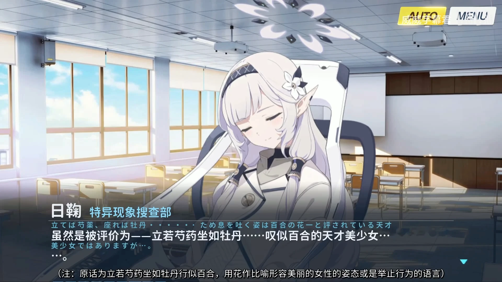
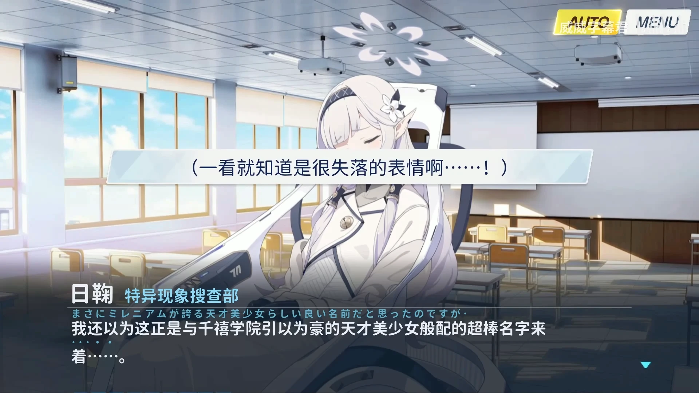

# 日鞠的五十一个名字

来源：https://anago.2ch.sc/test/read.cgi/applism/1679955711/ 424 楼

## 香汗淋漓超绝美少女

> 汗も滴る超絶美少女

晄轮大祭网页通知

## 太阳也嫉妒的超绝美少女

> 太陽も嫉妬する超絶美少女

来源同上

## 真理部的原部长，千年最高峰的病弱美少女，日鞠

> 「ヴェリタス」の元部長であり、ミレニアム最高峰の病弱美少女、ヒマリ

SPTF 活动 第 3 話「データ収集（３）PMC 発掘区域」

## 连感情也深藏于心底的悲剧美少女

> 感情さえ心の奥底に隠してしまう悲劇の美少女

## 能观测到基沃托斯所有情报的本天才美少女黑客

> キヴォトスのあらゆる情報を観測できるこの天才美少女ハッカー

研讨会剧情 価値の証明（２）

## 稀世的美少女

> 稀代の美少女

日鞠回忆大厅

## 盛开于云端之上的一朵鲜花

> 雲の上に咲く一輪の花

日鞠第一段剧情

## 倾国的完美 Beautiful Girl

> 傾国の完璧 Beautiful Girl

这个没找到

## 幸运的天才美少女（校对确认一下，幸运还是幸福）

> 幸せの天才美少女

日鞠第三段剧情

## 身份不明的真理部超美人部长

> 正体不明なヴェリタスの超美人部長

SPTF 特殊作战 序章

## 如新雪般高洁、如清水般通透的我

> 新雪のように高潔で、清水の如く透き通る私

虚妄圣塔活动 第 3 話;日常の亀裂（１）

## 被称为「全知」的超天才病弱美少女

> 「全知」と呼ばれる超天才病弱美少女の私

虚妄圣塔活动 第 3 話;日常の亀裂（１）

## 无懈可击的完美美少女

> 隙一つない完璧美少女

日鞠第一段剧情

## 清澈纯正的山泉水

> 澄みきった純正のミネラルウォーター

SPTF 序章

## 清纯可怜的病弱美少女

> 清楚で可憐な病弱美少女

## 清纯的高岭之花

> 清楚な高嶺の花

日鞠技能名

## 被称为「全知」的超天才病弱美少女

> 「全知」と呼ばれる超天才病弱美少女

虚妄圣塔活动？第 3 話;日常の亀裂（１）

## 沉机观变且才色兼备的美少女

> 即応性の高い才色兼備の美少女

没找到，这个真没找到

## 众人心服首肯的千年第一天才清纯系病弱美少女黑客

> 誰もが認めるミレニアム最高の天才清楚系病弱美少女ハッカー

日鞠好感剧情 1

## 被评价为——立若芍药，坐如牡丹……吐息似百合的天才美少女

> 立てば芍薬、座れば牡丹……ため息を吐く姿は百合の花――と評されている天才美少女

日鞠好感剧情 1

## 立若芍药，坐如牡丹，行似百合的我

> 立てば芍薬、座れば牡丹、歩く姿は百合の花の私

没找到

## 超绝美少女黑客

> 超絶美少女ハッカー

SPTF 第 12 話;新しいスタート

## 超天才黑客

> 超天才ハッカー

虚妄圣塔活动 第 19 話;「D.U.シラトリ区」防衛 战斗结束后对话

## 超天才清纯系病弱美少女

> 超天才清楚系病弱美少女

技能名称，剧情里面也出现过不止一处

## 超天才清纯系病弱美少女黑客

> 超天才清楚系病弱美少女ハッカー

剧情，情人节巧克力物品名

## 超天才清纯系病弱美少女黑客「明星日鞠」

> 超天才清楚系病弱美少女ハッカー「明星ヒマリ」

情人节剧情 超天才清楚系病弱美少女ハッカーの分身

## 超天才美少女

> 超天才美少女

好感剧情第二段

## 超天才病弱美少女

> 超天才病弱美少女

vol2 第二章第一话

## 超天才病弱美少女黑客

> 超天才病弱美少女ハッカー

vol2 第二章 16 话

## 天才美少女

> 天才美少女

个人剧情 1 momotalk

## 天才美少女黑客

> 天才美少女ハッカー

好感剧情第一话

## 美少女黑客

> 美少女ハッカー

SPTF 第 3 話;「データ収集（３）PMC 発掘区域」 战斗结束后剧情

## 病弱系美少女

> 病弱系美少女

SPTF 序章

## 病弱美少女

> 病弱美少女

个人好感剧情 1

## 病弱美少女的范本般的存在

> 病弱美少女のお手本のような存在

SPTF 序章

## 万年雪的结晶

> 万年雪の結晶

SPTF 序章

## 千年为之骄傲的超天才清纯系美少女黑客、获得「全知」学位的眉目清秀的少女

> ミレニアムが誇る超天才清楚系病弱美少女ハッカーであり、「全知」の学位を持つ眉目秀麗な乙女

回忆大厅

## 千年为之骄傲的天才美少女

> ミレニアムが誇る天才美少女

好感剧情 1

## 千年科技学院之中的天才黑客

> ミレニアムサイエンススクールにおける、天才ハッカー

SPTF 序章

## 盛放于千年的一朵鲜花

> ミレニアムに咲く一輪の花

SPTF 序章

## 千年清纯的高岭之花，为众人所憧憬的获得「全知」学位的眉目清秀的少女

> ミレニアムの清楚な高嶺の花であり、みなさんの憧れである「全知」の学位を持つ眉目秀麗な乙女

没找到

## 千年的超天才清纯系病弱美少女黑客

> ミレニアムの超天才清楚系病弱美少女ハッカー

抽卡的加入语音

## 千年的超天才美少女

> ミレニアムの超天才美少女

没找到

## 千年的超天才病弱美少女黑客

> ミレニアムの超天才病弱美少女ハッカー

虚妄圣塔 第 2 話;作戦会議

## 千年第一的清纯系美少女

> ミレニアム最高の清楚系美少女

个人剧情第一话

## 千年第一的天才清纯系病弱美少女黑客，盛开于云端之上的一朵花

> ミレニアム最高の天才清楚系病弱美少女ハッカーであり、雲の上に咲く一輪の花

个人剧情第三话

## 千年第一的天才清纯系病弱美少女黑客

> ミレニアム最高の天才清楚系病弱美少女ハッカー

个人剧情第一话、第三话

## 千年第一的天才清纯系病弱美少女黑客，明星日鞠

> ミレニアム最高の天才清楚系病弱美少女ハッカーの明星ヒマリ

抽卡加入语音

## 千年第一的美少女

> ミレニアム最高の美少女

L2D

## 千年最优秀的天才美少女黑客

> ミレニアム随一の天才美少女ハッカー

SPTF 第 3 話;「データ収集（３）PMC 発掘区域」

## 千年最高峰的超天才清纯系病弱美少女

> ミレニアム最高峰の超天才清楚系病弱美少女

Momotalk 备注
